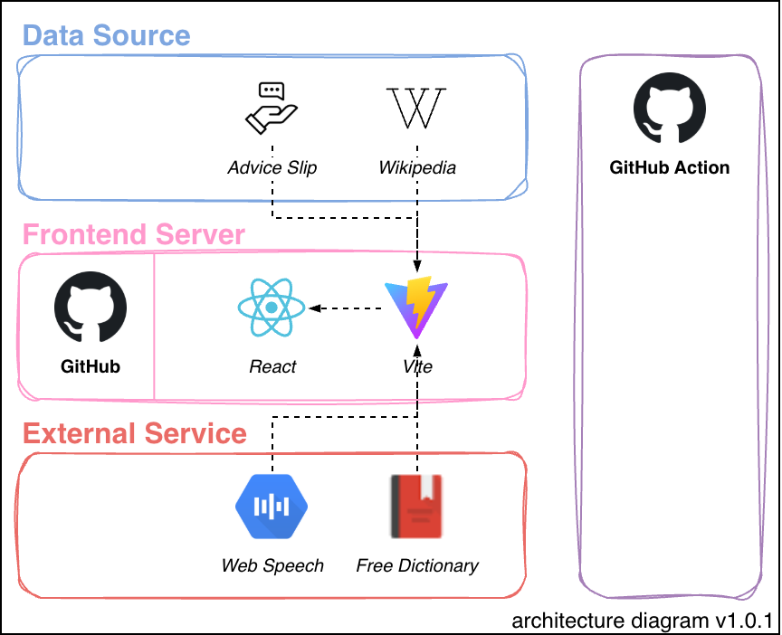

<!-- INTRODUCTION -->
# 🗣️ Come Again
Mastering a foreign language is a worthwhile endeavour that bridges cultural divides, yet traditional learning often places heavy emphasis on vocabulary retention and complex grammar rules. Still, as the often hesitant pronunciation of non-native speakers suggests, many would rather stay quiet than risk being misunderstood.

Meet Come Again, a free self-study app focused on pronunciation and built to give learners an affordable alternative to many existing options on the market. It dynamically assesses your speech, continuously helping you refine your pronunciation as you speak. By championing spoken interaction, it builds the confidence you need to stop people from saying, "Come again?"

  

  
  
  
<strong>First Published:</strong> 18 June 2026 <strong>Last Updated:</strong> 19 September 2026

<!-- ROADMAP -->
## Table of Contents
- [1 - Why We Built Come Again](#1)
- [2 - How Does Come Again Help?](#2)
- [3 - Behind the Scenes](#3)

<!-- SECTION 1 -->

## Why We Built Come Again
In my first week working overseas, I lost count of how many times my colleagues politely asked, “Come again?” I quickly realised that the culprit was my pronunciation. Our different accents were creating unnecessary friction. It became clear that, no matter how well you know the grammar, true conversational fluency requires you to bridge that gap. If we could just pronounce our words a little more clearly, we would not have such difficulty understanding one another.

Living in a place where English is not widely spoken can make everyday communication feel even more daunting. When you’re ordering food, asking for directions, or trying to make conversation, unclear pronunciation can quickly become a barrier and chip away at your confidence. Come Again uses speech recognition to identify mispronounced words, helping you speak more clearly and feel more prepared for real-life conversations.

  
  
<i>I don’t know what you talking leh.</i>

<!-- SECTION 2 -->

## How Does Come Again Help?
Come Again is designed to make speaking practice more immediate, practical, and less intimidating. Rather than asking learners to memorise isolated words or silently revise grammar rules, it encourages them to speak aloud and engage with language as it is actually used. The goal is not perfection, but clearer and more confident communication.

To support that process, the app provides reading material that users can practise in real time while tracking how closely their speech matches the reference text. This creates a feedback loop that helps learners identify weak points, revisit difficult words, and gradually improve their pronunciation through active use. While it does not replace natural conversation or a human tutor, it offers a useful stepping stone towards more confident speaking.

> [!NOTE]  
> Latency is expected because Come Again relies on free public APIs for real-time text fetching and pronunciation feedback, which may occasionally result in slower response times or intermittent failures.

  
  
<i>I speak goodest English, my power powerful.</i>

<!-- SECTION 3 -->

## Behind the Scenes
Come Again relies on the native **Web Speech API** to handle real-time speech recognition and audio capture directly in the browser, without requiring external backend services.

Users visit the site and start a practice session. Built with **React** and **Vite**, the application allows them to fetch text from **Wikipedia** or the **Advice Slip JSON API**. As they speak, the browser’s Speech API transcribes their speech and compares it with the reference text using a _Levenshtein distance_ algorithm. Mispronounced words are then checked against the **Free Dictionary API** for pronunciation feedback.

The application is hosted on **GitHub Pages**. Because it relies on client-side capabilities, transcription quality depends on the underlying browser implementation, meaning that accuracy and system compatibility may vary from user to user.

  

<!-- DISCLAIMER -->
---

**This was created as a personal hobby project and learning exercise.**
